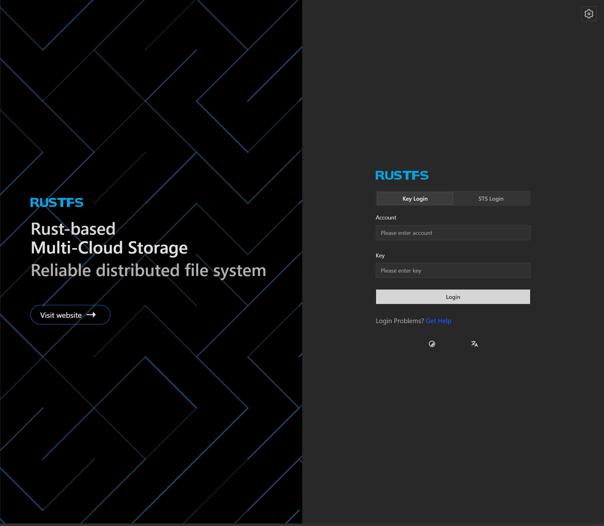
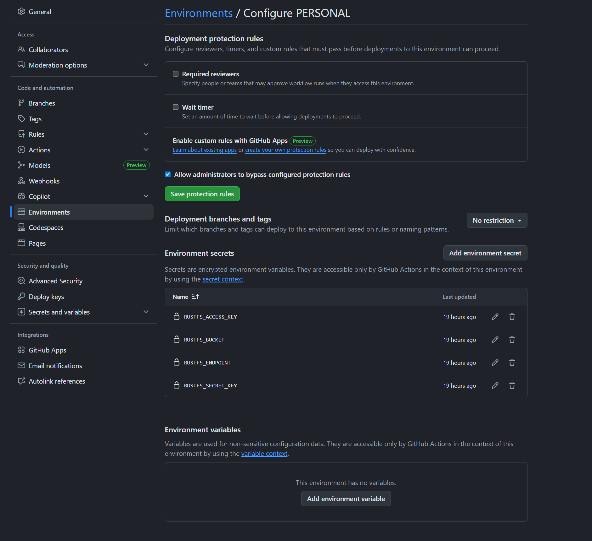
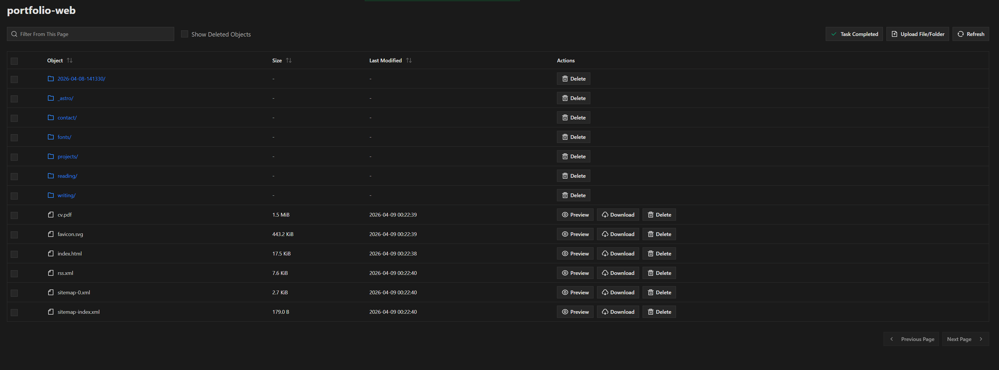

## Context

I rewrote my personal portfolio website on Astro to save some RAM that the NextJS process was eating up, but that brought with it an annoying complication: I had to copy over the files from the `npm run build` process into my VPS and then point `nginx` at it somehow. I wanted to strap it to my personal VPS instead of using my AWS account or any cloud provider because I'm a total cheapskate, and since I'm renting a VPS on Hetzner already, I decided to just use it for that as well.

While yes, the free tiers of cloud providers are more than ample for my needs, I overall dislike relying on it when I could use what's on hand to achieve the same effect.

Last year, at work, I set up a [min.io](http://min.io/) server for S3 storage for on-premise servers to handle file uploads. Since I had some experience with it, I decided to use it again, only to find out that it had gone all-in on the enterprise offering, and the documentation for the open-source version had been obscured with too many dark patterns. After Googling for a couple minutes, I found an adequete replacement in [RustFS](https://rustfs.com/), which was a pleasure to set up because it took 5 minutes tops.

## Implementation

### Step 1: Setup RustFS

Setting up RustFS is perhaps too easy. You just run a one-liner script which you can follow on their official website: https://docs.rustfs.com/installation/linux/quick-start.html

```sh
curl -O https://rustfs.com/install_rustfs.sh && bash install_rustfs.sh
```

Once you download it, it'll strap up everything for you. My Linux distro is Fedora, and I think most modern distros have moved to `systemd` so you can run the `systemctl status rustfs` command to get the filepath of its config file.

```sh
[root@fedora-2gb-sin-1 ~]# systemctl status rustfs
● rustfs.service - RustFS Object Storage Server
     Loaded: loaded (/usr/lib/systemd/system/rustfs.service; enabled; preset: disabled)
    Drop-In: /usr/lib/systemd/system/service.d
             └─10-timeout-abort.conf, 50-keep-warm.conf
     Active: active (running) since Wed 2026-04-08 14:20:59 UTC; 18h ago
 Invocation: 4d596211cec54d85ad8316311e1731ce
       Docs: https://rustfs.com/docs/
   Main PID: 2375831 (rustfs)
     Status: "Starting..."
      Tasks: 18
     Memory: 158.6M (peak: 173.3M)
        CPU: 5min 15.819s
     CGroup: /system.slice/rustfs.service
             └─2375831 /usr/local/bin/rustfs /data/rustfs0
```

For me, the config file is in `/usr/lib/systemd/system/rustfs.service`. We simply open it up in our file editor of choice (vim for me) and then take a look at it.

```sh
[Unit]
Description=RustFS Object Storage Server
Documentation=https://rustfs.com/docs/
After=network-online.target
Wants=network-online.target
[Service]
Type=notify
NotifyAccess=main
User=root
Group=root
WorkingDirectory=/usr/local
EnvironmentFile=-/etc/default/rustfs
ExecStart=/usr/local/bin/rustfs  $RUSTFS_VOLUMES
LimitNOFILE=1048576
LimitNPROC=32768
TasksMax=infinity
Restart=always
RestartSec=10s
OOMScoreAdjust=-1000
SendSIGKILL=no
TimeoutStartSec=30s
TimeoutStopSec=30s
NoNewPrivileges=true
ProtectHome=true
PrivateTmp=true
PrivateDevices=true
ProtectClock=true
ProtectKernelTunables=true
ProtectKernelModules=true
ProtectControlGroups=true
RestrictSUIDSGID=true
RestrictRealtime=true
StandardOutput=append:/var/logs/rustfs/rustfs.log
StandardError=append:/var/logs/rustfs/rustfs-err.log
[Install]
WantedBy=multi-user.target
```

We snatch the `EnvironmentFile` parameter and do the same for that file as well, which for me is `/etc/default/rustfs`.

```sh
RUSTFS_ACCESS_KEY=ACCESS_KEY
RUSTFS_SECRET_KEY=SECRET_KEY
RUSTFS_VOLUMES="/data/rustfs0"
RUSTFS_ADDRESS=":9000"
RUSTFS_CONSOLE_ADDRESS=":9001"
RUSTFS_CONSOLE_ENABLE=true
RUSTFS_OBS_LOGGER_LEVEL=error
RUSTFS_OBS_LOG_DIRECTORY="/var/logs/rustfs/"
```

Here, you see the Access Key and the Secret KEy parameters, as well as the root path of where all your S3 objects will be in case you want to do manual cleanup later on, or permission stuff; but if you know your way around the terminal, you most likely wouldn't need this guide.

After that, we somehow access the RustFS Admin Console. My go-to method is using `ssh` for local port forwarding for security-purposes and then handling it, but you can do anything that you'd like:

```sh
ssh -i ~/.ssh/ssh_key.pem -L 9001:localhost:9001 user@ip-address
```



Then we log into it using the Access Key and Secret Key we got, and go on to create our S3 bucket. The UI from here on is pretty standard so we'll leave it at that.

### Step 2: Setup AWS CLI

Next, we'll set up the AWS CLI, which you can find out more about at https://docs.aws.amazon.com/cli/latest/userguide/cli-chap-getting-started.html

First, we install it, and most distros don't ship their own `awscli` nowadays, so you'll have to do it either by using your package manager of choice and finding the repository for it, or just handle the executable directory as per AWS's guide at https://docs.aws.amazon.com/cli/latest/userguide/getting-started-install.html.

```sh
curl "https://awscli.amazonaws.com/awscli-exe-linux-x86_64.zip" -o "awscliv2.zip"
unzip awscliv2.zip
sudo ./aws/install
```

Then you'll actually set it up to work with your RustFS server. The AWS CLI is set up to work with any S3-compatible storage, or depending on how you look at it, all the open-source projects that handle S3 storage are interoperable with the AWS CLI so you'll have no trouble.

Just go through all the steps of the `configure` command like so and fill in the Access Key and Secret Access Key we got from RustFS's config file:

```sh
$ aws configure --profile $PROFILE_NAME
AWS Access Key ID: ACCESS_KEY
AWS Secret Access Key: SECRET_KEY
Default region name [None]:
Default output format [None]:
```

Then we check on our S3 buckets by listing them, but since we don't want it to actually hit up AWS's servers with our credentials (becasuse it doesn't exist there), we provide our `RUSTFS_ADDRESS` parameter from way up above.

```sh
aws --endpoint-url http://localhost:9000 s3 ls --profile $PROFILE_NAME
2026-04-08 14:03:36 portfolio-web
```

Like that, we confirm that our bucket is there and we can actually access them.

### Step 3: Setup CI/CD

Next up, we'll move on to actually setting up the CI/CD part. First, we go to our Github repository and my preference is to create an Environment to put my secrets in: https://docs.github.com/en/actions/how-tos/deploy/configure-and-manage-deployments/manage-environments

My environment is called `PERSONAL`, as you can see at the top. The reason we use Secrets is because I don't actually want anyone to somehow find out my access key and secret key. I also hid the endpoint and the bucket name for no real reason, you don't have to do them.



Now that we actually set that part up, we go to the most cookie-cutter part: the actual .yaml config.

```yaml
name: Build & Deploy to VM

on:
  push:
    branches:
      - main

jobs:
  build-and-upload:
    runs-on: ubuntu-latest
    environment: PERSONAL

    steps:
      - name: Checkout code
        uses: actions/checkout@v3

      - name: Setup Node.js
        uses: actions/setup-node@v3
        with:
          node-version: "22.12.0"
          cache: npm

      - name: Install dependencies
        run: npm ci

      - name: Build site
        run: npm run build

      - name: Install AWS CLI
        run: |
          python3 -m pip install --upgrade pip
          python3 -m pip install --user awscli
          echo "$HOME/.local/bin" >> "$GITHUB_PATH"

      - name: Upload dist/ to RustFS
        env:
          AWS_ACCESS_KEY_ID: ${{ secrets.RUSTFS_ACCESS_KEY }}
          AWS_SECRET_ACCESS_KEY: ${{ secrets.RUSTFS_SECRET_KEY }}
        run: |
          aws --endpoint-url ${{ secrets.RUSTFS_ENDPOINT }} s3 sync dist/ s3://${{ secrets.RUSTFS_BUCKET }}/
```

What it's doing is basically: specifying which OS to build on, what command to run, and then it installs the AWS CLI which it configures with our RustFS credentials like we did manually before (the real reason we did that will come in the next step) and then we upload that to the S3 bucket.



After it successfully runs, we go to our bucket and we see that it actually worked!

### Step 4: Setup Crontab for S3 Sync

Setting up an `nginx` server is out-of-scope for this guide, so we'll just assume you point that to a directory. For me, it's `/applications/portfolio-web` so my goal is to now sync the contents of the S3 with my filesystem's `/applications/portfolio-web` directory.

The easiest and fastest way to go about it, in my opinion, is to just set up a crontab that occurs every couple minutes.

```sh
crontab -e
```

We open up the file for editing and we add an AWS CLI command that's built specifically to sync an S3 contents to a filepath (how neat).

```sh
* * * * * rm -rf /applications/portfolio-web/* && aws --endpoint-url http://localhost:9000 s3 sync s3://portfolio-web/ /applications/portfolio-web/ --exact-timestamps --profile $PROFILE_NAME
```

What this is doing is basically deleting the entire contents of the website, then running AWS sync to repopulate it. While this may result in the website just being gone and resulting in a 404 every now and then, that's a price I'm willing to pay.

`* * * * *` is for a cronjob that runs every minute.

```sh
* * * * *
│ │ │ │ │
│ │ │ │ └── Day of week (every)
│ │ │ └──── Month (every)
│ │ └────── Day of month (every)
│ └──────── Hour (every)
└────────── Minute (every)
```

You can modify it to `* * * * 5` to happen every 5 minutes, or every hour by `* * * 1 *`. Find out more at https://crontab.guru/.

## Conclusion

Thank you for sticking with the guide this far. Please don't be intimidated. It's easier than it seems.
