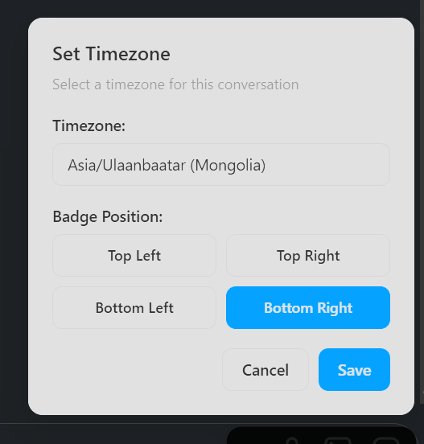

## Context

I was chatting with a bunch of people in different time zones, including friends and freelance clients. Keeping track of all their times was a bit of a headache, so I decided to vibe code something that lets me track their current time. I might be one of the few psychopaths who actually uses the web client of Instagram and Discord, but hey, progress in AI lets us do whatever we want even if the ROI is low.

## Implementation

This resulted in a Chrome Extension that checks if the URL is one of these 2 websites (the ones the extension supports):

- https://instagram.com
- https://discord.com

Then if it is, I check the URL again and find the unique ID of the chat in particular. Then using that unique ID, I map the unique user or group chat to a certain timezone. Then with a slight JS Date object math, I can get the current date in their date zone. That was pretty neat, but as you can see in the image below, the positioning is blocking the Instagram web client's send button, including the attachments and stickers too.

So when I click on it, it used to only have a dropdown that lets you select time zones, but I also added a couple extra buttons that determine the position of the clock so I can move it to the top right, send the attachment and then move it back to bottom left (my preferred location, perhaps due to Windows normalizing the time being at the bottom right).

## Conclusion

It was easy enough, and it solved something that was forcing me to do minor math every time I talked to anyone overseas so that's a win in my book. It's not that I hate doing math, but reducing the friction of everyday challenges lets me have more energy to direct somewhere that's more important, or more fun (maybe teetering toward the latter).

## Links

- Github: https://github.com/khosbilegt/chatclock
- Chrome Web Store: https://chromewebstore.google.com/detail/chatclock/binchhkiklflbbahepfbhmcjinnfkole
