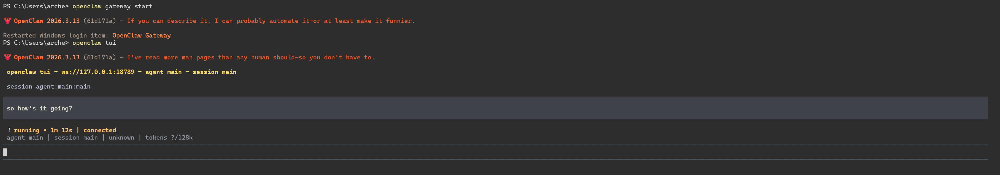

## Context

My entire feed was completely dominated by OpenClaw for the last couple months and I decided to give it a try. Because at the moment, I'm very much a broke university student with a gaming PC, I decided to try my hand at running it with a local model via Ollama. Unfortunately, fate had other plans for me.



Seeing that I hadn't made my monthly LinkedIn post to keep up my visibility, I decided to just turn it into a simple Python script and keep the streak going.

That, and I found the idea of reducing the toll on my morning mind when my anti-OCD software hadn't actually booted yet.

## Implementation

### 1. Gmail API

Initially, I opted to use the [gogcli](https://github.com/steipete/gogcli) tool as I had some experience with it previously. However, after I was 90% through the project, I found out that it actually couldn't modify the received emails. It could send, but it couldn't modify. Quite an odd limitation to have.

So I ended up using the Gmail API through Google Cloud.

### 2. Classification

Since I wanted to use Ollama for the classification, I did end up using `gemma3:1b` --one of the better models my computer could run without screaming-- to actually classify the email, and once classified as either important or not, it then marks it as read or keeps it as unread.

```python
def ollama_classify(email_text, model="gemma3:1b"):
    prompt = f"""
    You are an email triage assistant. Read the following email content and classify it as important or not.

    Rules:
    - Only mark emails from real people as important.
    - Newsletters, marketing emails, or automated notifications should not be marked important.
    - Output must strictly follow this format:

    Result: True or False
    Reason: <reasoning text if True, otherwise leave empty>

    Email content:
    {email_text}
    """

    response: ChatResponse = chat(
        model=model,
        messages=[{"role": "user", "content": prompt}]
    )

    content = response.message.content.strip()

    result_match = re.search(r"Result:\s*(True|False)", content, re.IGNORECASE)
    result = result_match.group(1).lower() == "true" if result_match else False

    reason_match = re.search(r"Reason:\s*(.*)", content, re.DOTALL)
    reason = reason_match.group(1).strip() if result and reason_match else ""

    return result, reason

```

## Conclusion

It is quite obvious that most people who use Openclaw with local models would come to the conclusion that it's overhyped, but when I spent 50 cents from my OpenAI account and ran it with `gpt-5.4-pro`, its performance was quite good. However, when I used its recommended model --`glm-4.7-flash`-- it actually couldn't get much done and on my hardware (Nvidia RTX4070), each request took nearly 2 minutes as evident from the first figure.

Maybe at some point local models will actually be viable, but until that point, I will most likely not use it for personal purposes for the foreseeable future.
