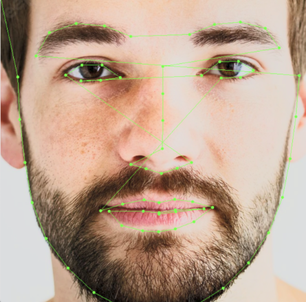
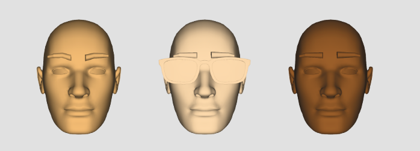

## Context

During my undergraduate studies, I was really into games. My thesis was a motion-controlled game, actually. I had the idea for a user to take a selfie and build their customized 3D avatar for them and would have loved to do more research into this course, but the session was only 12-weeks-long and the assignment itself was only 4 weeks. Sadly, that wasn't enough time to learn 3D modeling so the results were less than stellar.

The idea was to extract a user's facial parameters without actually using machine learning, but what ended up happening was I ended up using `italoj`'s Facial Landmark Recognition.dat file to find the points on the user's face first.

Then I did some math and trigonometry to determine the shapes of a user's brows, the shape of their nose, whether they wore glasses and their skin tone, to get out a very unflattering result that looks like this:

If I had some more time, I would have loved to add more polish, add some high-low cheekbone detection and finding the ratio of the features and get a more malleable 3D model to shape.

## Implementation

Here is a Mongolian writeup of the assignment in research paper format: [https://drive.google.com/file/d/1a9TM1EF_eyNjFv2_iN6LGt7M6piuDLad/view](https://drive.google.com/file/d/1a9TM1EF_eyNjFv2_iN6LGt7M6piuDLad/view)

The Github project is accessible at: https://github.com/khosbilegt/AvatarCreator
