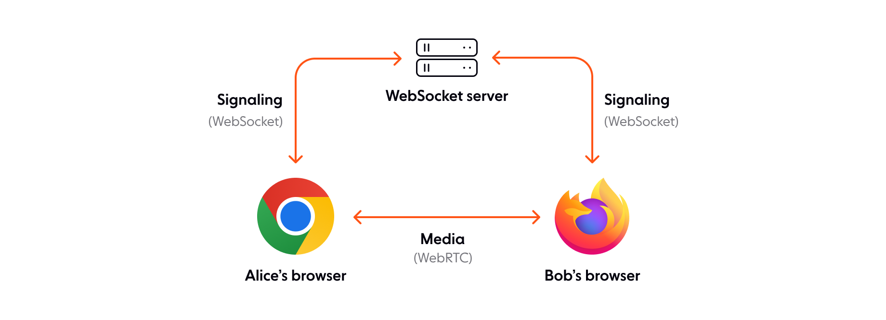

## Background

Recently I took on the challenging task of changing the underlying software for a WebRTC server for help desk agents for our internally-developed Call Center solution.



This meant that I would be replacing the WebSocket server of the above graph.

It required me to somehow leverage the JWT tokens generated by a third-party authorization provider and then provide said token to our SIP Server (Kamailio) with custom configurations. The SIP Server itself could easily handle the authorization on its side. The challenging side was actually sending the tokens, which wasn't as simple as adding a new header or leveraging the Authorization header as is the case with REST requests.

Passing it as a password for the SIP part of the connection was also not an option, as the moment it was sent, it was then encrypted into Digest Authentication and would require a change to the SIP Server's source code to extract and/or add a module for OAuth authentication to be usable.

## Implementation

The first large hurdle I came across was the Websocket protocol as a whole. Contrary to expectation, it did not allow any custom headers nor did it have the same headers as normal REST requests. Matter of fact, there was only 1 header that could be modified: the "Sec-WebSocket-Protocol" header. But I could make do with that, so I tested it from my Postman app and it reached our SIP Server perfectly.

Then I came across another difficulty: actually passing in the header value to the Node module (JsSIP) that we used to connect our web app to the SIP Server, only to find that it didn't provide such an option.

That forced me to take a dive into the source code of the library, which was thankfully open-source. Finding the internal logic of Websocket connections wasn't difficult and I found out that it only sent out a single value to the "Sec-WebSocket-Protocol" header: 'sip'.

This header is then used for the Websocket connection to later be upgraded to accept SIP requests and seamlessly integrates with the SIP protocol. After a little digging into our SIP Server's configuration, I found out that manipulating the header values that are used for upgrading to a SIP connection was a straightforward process. This meant that I could easily extract the JWT token from the header, then send the required 'sip' value for the protocol header.

The next issue came in the form of editing the Node module and actually using it from other Node projects, which forced me to once again dig through documentation until I found that you could download a node module from a compressed file, which I later proceeded to point to from our package.json file which completed the integration. The change itself was straightforward, which you can find here.

```js
// Original Code
this._ws = new WebSocket(this._url, "sip");

// Modified Code
const protocols = ["sip"];
if (this._appendedProtocols && this._appendedProtocols.length > 0) {
  protocols.push(...this._appendedProtocols);
}
this._ws = new WebSocket(this._url, protocols);
```

## Conclusion

After I completed the change and opened a pull request (which was soon denied), I realized the fact that this kind of obfuscation and level of integration wasn't required for most webs and Node projects using the JsSIP library. As this was an edge case even among other edge cases, the fork is made public for anyone that faces the same unorthodox situation as is my case.

You can find the project here: https://github.com/khosbilegt/JsSIP
