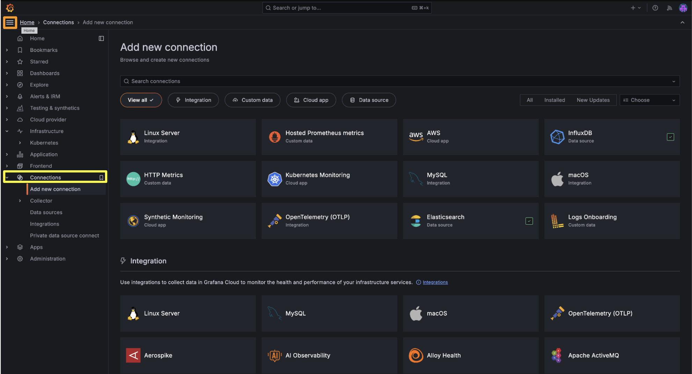
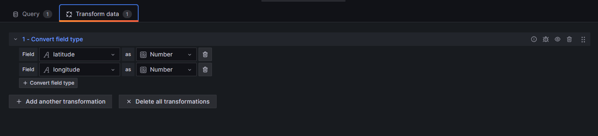
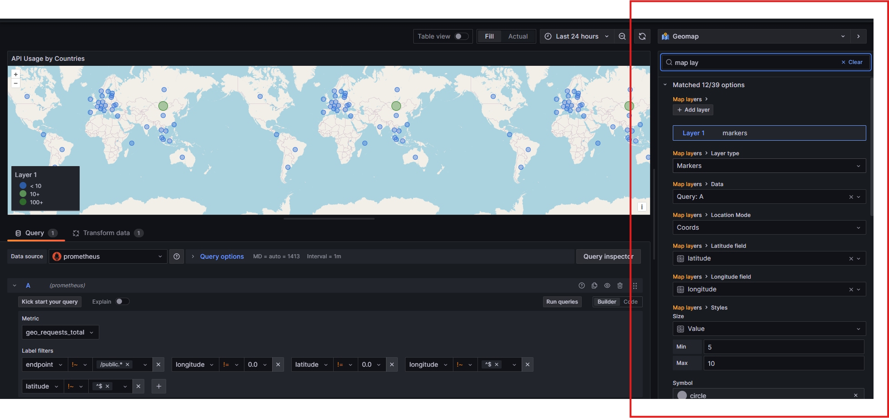
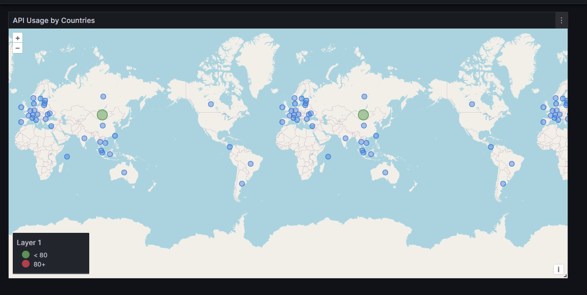

## Background

One day, I woke up and decided to track just how many API Calls my portfolio web was getting and from which countries the requests were being called from. To do that, I initially thought of messing with the source IP Addresses of the requests and logging the locations, but after a slight amount of research, I came upon a simpler solution.

## Implementation

### 1. Nginx GeoIP Module

Nginx has a configurable module that automatically maps the source IP address to either a country or a city with slight effort. As it isn't a built-in module, but one that must be specifically configured, it requires cloning the Nginx Source Code and compiling it.

While you must compile Nginx, you don't actually have to install it. Instead, you only need to use it to generate GeoIP's dynamically linked library ngx_http_geoip2_module.so and move it to Nginx's dynamic module directory.

```
[root@fedora-2gb-sin-1 ~]# nginx -v
nginx version: nginx/1.26.3
```

After you find your Nginx version, you must download the source code for that specific version. If a version mismatch happens, your running Nginx instance will not be able to utilize your dynamic linked library.

```
wget http://nginx.org/download/nginx-VERSION.tar.gz
tar zxvf nginx-VERSION.tar.gz
cd nginx-VERSION
```

To build the modules, you must download any dependencies the compilation requires and execute the following commands.

```
./configure --with-compat --add-dynamic-module=/path/to/ngx_http_geoip2_module
make modules
```

This will produce objs/ngx_http_geoip2_module.so. It can be copied to your nginx module path manually if you wish.

Add the following line to your nginx.conf:

```
load_module modules/ngx_http_geoip2_module.so;
```

### 2. Nginx Configuration

After generating the linked library, you must now actually use it for your specific server configuration. In my case, I used it for my own portfolio web's configuration so it looks something like this:

```
server {
listen 80;
server_name khosbilegt.dev www.khosbilegt.dev;

    location /.well-known/acme-challenge/ { # Required for Certbot
        root /var/www/html;
    }

    return 301 https://$host$request_uri;  # Redirect HTTP to HTTPS

}

geoip2 /usr/share/GeoIP/GeoLite2-Country.mmdb {
$geoip2_city_name city names en;
$geoip2_country_name country names en;
$geoip2_latitude location latitude;
$geoip2_longitude location longitude;
}

log_format geo_log '$time_local $geoip2_country_name $request_uri';
access_log /var/log/nginx/geo.log geo_log;

server {
listen 443 ssl;
http2 on;
server_name khosbilegt.dev www.khosbilegt.dev;
gzip_static on;
gzip_proxied expired no-cache no-store private auth;

    ssl_certificate /etc/letsencrypt/live/khosbilegt.dev/fullchain.pem;
    ssl_certificate_key /etc/letsencrypt/live/khosbilegt.dev/privkey.pem;

    location / {
        root /applications/portfolio-web;
        index index.html;

        try_files $uri $uri/ /index.html;
    }

}
```

You will have to add the GeoIP module's definition, and to do this, you must download a Maxmind DB file that contains your relevant information from here: https://github.com/P3TERX/GeoLite.mmdb

After downloading it, you must point to that file from your Nginx configuration from the root level. Then whenever a request comes in, I opted to write a simple log file with a custom format that writes the requests in this format.

```
30/Mar/2025:15:53:35 +0000 Mongolia /geo
30/Mar/2025:15:54:35 +0000 USA /geo
```

### 3. Simple Metrics Middleware

Prometheus works by calling API endpoints, so I made a small middleware service that reads the geo.log, increments a metric utilizing Python's official Prometheus client and exposes a /metrics endpoint for Prometheus to scrape.

Because I didn't want to actually map the exact longitudes and latitudes of the requests, but find the country and draw a visualization on the capital city of the country, I also added that logic into this middleware service. It is possible to also extract the assumed locations of the API callers and use them raw.

You can find the middleware that I used at: https://github.com/khosbilegt/geolog-access-reporter

To deploy the miniature Python web server, I used a Systemd service on my VPS but you may use anything you like. I strongly suggest deploying the service on the same server as your Prometheus instance, as that decreases network usage significantly.

### 4. Prometheus

Installing Prometheus is as straightforward as it could be, which is easily manageable by going through their guide at https://prometheus.io/docs/prometheus/latest/installation with an option for using Docker.

After installing it, you must create a job that scrapes your Python server's metric endpoint inside prometheus.yml.

```
scrape_configs:

- job_name: "access_reporter"
  metrics_path: /metrics
  static_configs:
  - targets:
    - "127.0.0.1:5000"
```

### 5. Grafana

After your Prometheus instance starts scraping the data, it starts to stockpile metrics and the only challenge left is actually showing it on Grafana. Obviously, you must also download and deploy a Grafana instance that can also be done via Docker: https://grafana.com/docs/grafana/latest/setup-grafana/installation/

#### 1. Add Datasource

To connect your Prometheus with Grafana, you must add it as a Data Source and point to your Prometheus instance.



### 2. Create Geomap Panel

After that, you must create a Dashboard and add a Visualization, then select Geomap from among the options at the top right corner.

To query data from your Prometheus instance, you must use a custom query language called PromQL. It is a self-explanatory query language that can easily be generated through LLMs. The specific query that I settled on was this one:

sum by(country, latitude, longitude) (increase(geo_requests_total{endpoint!~"/public.\*", longitude!="0.0", latitude!="0.0", longitude!~"^$", latitude!~"^$"}[1h]))

Note that the name "geo_requests_total" is defined by what metric that your metrics middleware service is incrementing.

What it is doing is that:

Query the metric 'geo_requests_total'.
Exclude all endpoints that start with '/public' from visualizations.
Only query those that have a longitude and latitude value that isn't equal to 0 (in which case my middleware failed to find the capital city's location).
Calculate the increase in API calls during that specific period of time, which I chose as 1 hour but can use Grafana's built-in $\_\_rate_interval value. This value is shown on the Geomap.
Group the endpoints by country, longitude and latitude (for any value of country, the longitudes and latitudes are the exact same) and aggregate them via sum. You may also forgo this step and visualize your endpoints separately.
However, there is 1 problem with this approach.

As our middleware (and due to how Prometheus works), we sent our longitudes and latitudes as strings!

To actually transform that so that our Grafana may understand that they are the value, you must use a transformer of the type "Convert field type". This allows you to interpret those strings (which are considered tags in Prometheus) as numbers.



After you change the Longitudes and Latitudes into numbers, you must now map them in the Geomap visualization's configuration alongside the Value fields.

After you do this, you arrive at the end result shown below.



The colors can be tweaked using the Threshold parameter of the Visualization.



## Conclusion

Note that you should periodically prune your Prometheus data as it can grow considerably quickly.

Update: Grafana at https://grafana.koso.dev has been shut down to make room for other projects.
