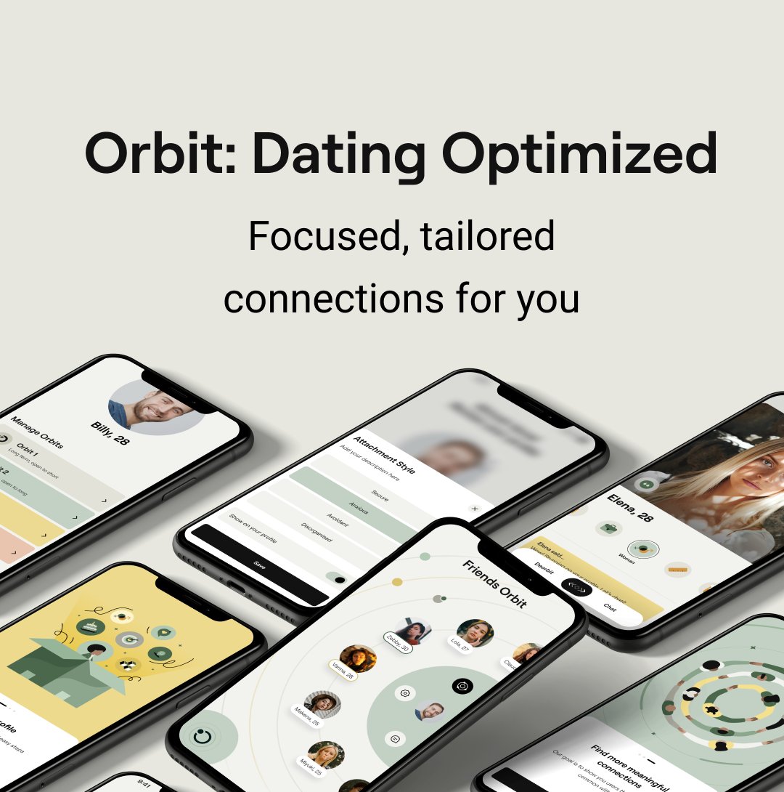

Orbit is currently my main project and day job where I work as a Founding Engineer. I've tried to incorporate various features that could be the solution to the current mess that dating apps propagate, such as swiping culture and people on those apps being viewed as dopamine fuel. You can find out more about Orbit at our official web at https://useorbitapp.com/.

While some parts of the development process were in my comfort zone, I've had to venture out of it and into the shoes of a Product Developer as well as UI/UX designer on some ocassions. E.g: I've never had to seriously use Figma before and recently had to create the App/Play Store screenshots to make them similar to those of other dating apps --following the meta, if you will. You can find one of my creations below.

I also had to migrate the website from [Webflow](https://webflow.com/) to a plain Node CMS for cost management purposes; and in the process, made the discovery that Webflow may or may not have started sponsoring [GSAP](https://gsap.com/) (making them free) to enable their "Export Website to Code" feature because all their animations are based on GSAP and they couldn't just monetize that feature without doing it.

We're currently going through the App/Play Store review process and looking to launch sometime in late April or early March.

For those wondering, yes, I may have performed some resume-driven development so it might be a tad bit overengineered (but that's a good thing).

I also have this neat email to go with it if you want to reach out in regards to the app: khosbilegt.b@orbitapp.co.uk

We've got some cool features, including, but not limited to:

- Unique and quirky UI
- Different UI for Mobile and Tablet views
- Left-hand mode
- Bots to practice cheesy pick-up lines on (they can unmatch with you)
- Free trial! (but only in some places because it's a bit resource and cost intensive)

But that's about all that I'll disclose at this stage, as we still haven't launched yet. Also, if you see any blogs on our official website, those posts would have either been written by me or went through me (though we haven't added them yet).

