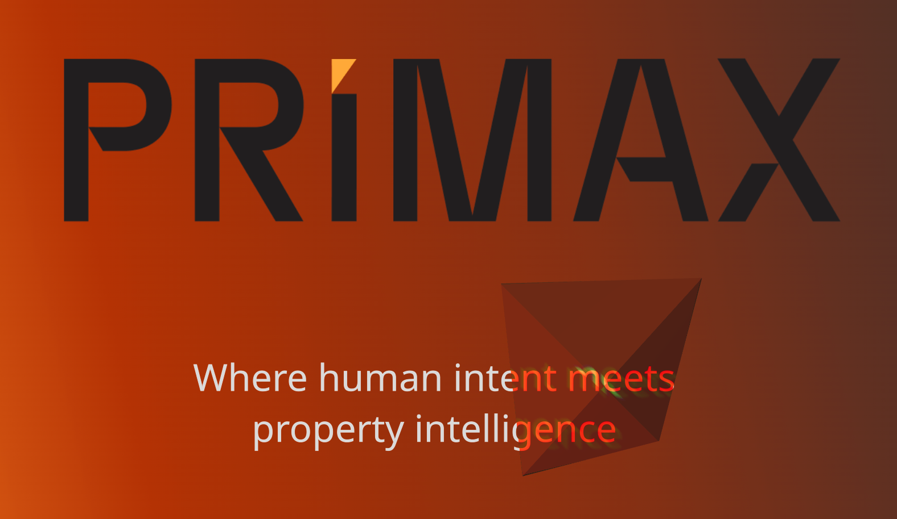

## Case Study

[Primax](https://primaxai.io/) was my first Australian client that I got in contact with thanks to my uncle. The nature of the job was simple: design is ready, we want this kind of vibe, please write the code and make sure we can edit the content with a CMS. That prompted me to look up some options, including Strapi, Wordpress, Sanity, Storyblok etc, but I ended up using PayloadCMS due to ease of use, which I proceeded to use for several other of my projects, including the previous version of my portfolio website.

You can read the design specifications and case study built by Extrablack [here](https://extrablack.com.au/project/primax-proptech-taking-the-guess-work-out-of-pricing/).

### Landing Page

The Landing Page itself was quite simple, albeit with lots of tiny details that you have to do by hand such as spacing, micro-animations and a sleek design that felt like iOS. If I had been asked to do the designs myself, it would have been quite a challenge but seeing that the designs were already made, my involvement on that part was small. It was a nice change, and the first project where I paid more attention to on the frontend than the back. Most of my other projects ended up being very processing, business-logic heavy so this reminded me that the user journey and experience was important as well. That prompted me to watch as much content related to UI/UX I could find whenever it came onto my feed on Youtube.

To add some flair to the Hero section, I ended up using ThreeJS to create a see-through pyramid that rotates, following the user's cursor with a monochromatic effect for the text underneath.

### AI Receptionist

The most fun part of the contract was the AI Receptionist, which can be accessed both through the website and a mobile line using a Twilio number. I used ElevenLabs and its studio to choose a very-heavy Australian-accented voice, which Primax attached to Gerald, their Chief Sales Officer. See him in action [here](https://primaxai.io/urbanity-2025). Strapping it into their operational CMS of choice was a delight and easy to use, and there was barely any lag when I was testing it. Something that would have taken at least a week of fiddling with APIs and LLM providers, strapped with speech-to-text models was turned into an afterthought thanks to Elevenlabs, which is quite impressive.

## Conclusion

This collaboration reminded me that even if something works under the hood, the outside appearance is just as important and made me pay more attention to UI/UX than I used to before. Even if the engine is strong, if it doesn't look like a Ferrari, it's not one; and that is doubly true for a marketing device like landing pages.
