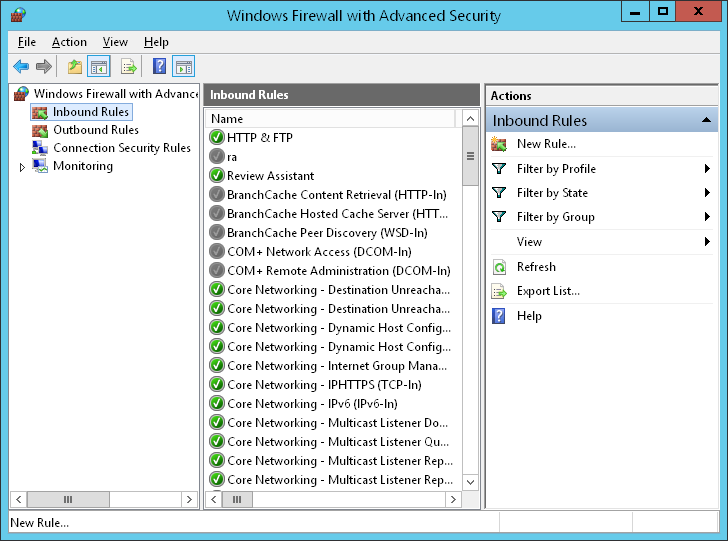

## Background

While building a Shopify app, I quickly ran into a common challenge: how to receive webhooks sent from Shopify’s servers to my local development environment. Webhooks are essential for real-time communication, allowing Shopify to notify your app about events like product updates, order creations, and more. However, because my app was running on my local Windows PC without a static IP, Shopify’s servers could not reach it directly.

I explored several solutions, from using third-party tunneling services like ngrok to setting up complex VPNs, but they either introduced latency, cost, or complexity I wanted to avoid. Then I discovered the power of reverse SSH tunneling from a VPS to my local machine. This approach allows me to expose a port on my VPS that forwards incoming webhook requests straight to my Windows PC securely and reliably.

While I did use it before to connect to the server before, I had never used it to send anything to myself.

In this post, I will share how I set up a reverse SSH tunnel specifically to receive Shopify webhooks on my local Windows service.

Note: While this approach was more convenient to me, in most cases, services like ngrok and tailscale may better suit your purposes. To explain why I came to this conclusion, these were all things that I already had available:

- Pre-rented VPS Server
- Pre-bought Domain
- Pre-configured nginx server
- Moderate experience with Linux

## Implementation

### 1. Prepare VPS

I already had a VPS lying around which I use to run my portfolio site and in this niche use case, this was the most convenient approach for me. This means that I had already set up an nginx server with a proper HTTPS certificate, making this part a non-issue. I currently use Hetzner as they provide the best cost-to-value ratio but you can use your VPS provider of choice.

You'll need the following before proceeding further:

Web server able to receive HTTPS requests.
Actively running sshd

### 2. Modify sshd config

You must first modify /etc/ssh/sshd_config on your VPS and add or uncomment the following lines:

AllowTcpForwarding yes
GatewayPorts yes

This ensures that you are able to initiate a tunnel from your local machine.

### 3. Create SSH Tunnel

ssh -v -N -R 0.0.0.0:PORT:127.0.0.1:PORT user@IP_ADDRESS

Going step-by-step, what the command is doing is that:

-v: provides verbose logs.
-N: by default, ssh opens a console connected to your server. You don't want that in this case.
-R: used to bind an address on the target machine to your current machine in this format: TARGET_INTERFACE:PORT : LOCAL_INTERFACE:PORT
If you are using an ssh key, as you should be, then you will also have to modify the command accordingly.

This command was the source of most of the headache that I went through, such as taking IPV6 as a default when I wanted IPV4 etc.

For an in-depth breakdown, feel free to read up on it at https://iximiuz.com/en/posts/ssh-tunnels/.


### 4. Modify Firewall Configuration

You are able to add an inbound rule to your Windows Firewall's configuration by running using Windows+R and running the wf.msc app. You'll simply have to create a new rule with the protocol TCP and the port you chose to receive your requests in.



### 5. Route to Port

I simply chose a random route and routed that to my forwarded port inside my nginx configuration by adding it to my pre-existing nginx configuration.

```
    location /webhooks/shopify {
        proxy_pass http://localhost:4001;
        proxy_set_header Host $host;
        proxy_set_header X-Real-IP $remote_addr;
        proxy_set_header X-Forwarded-For $proxy_add_x_forwarded_for;
        proxy_set_header X-Forwarded-Proto https;
    }
```

## Conclusion

With that, I had a fully-functioning SSH Tunnel for all purposes, including receiving a webhook from Shopify. While it was quite a simple configuration problem, it did manage to take up 2 hours of my time.
