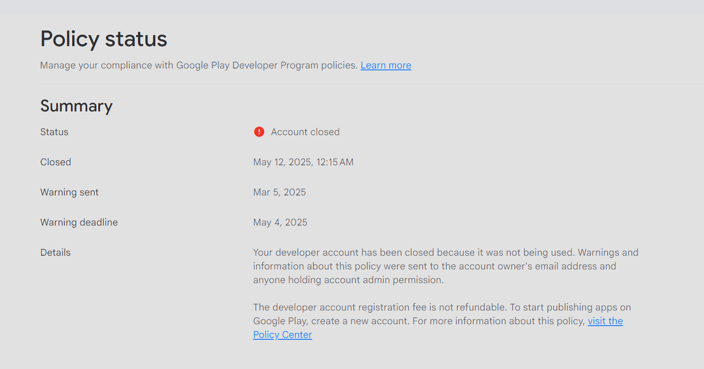

I recently built a mobile app on the side to put up on my CV. Obviously, that also means I would want it on the Play Store and the App Store. That would, in turn, also imply that I would have to create developer accounts and publish the app.

I assumed that I could just use my personal name, put it out there and forget it. If an occasional bug report or complaint came, I would resolve it and move on, but no~!

Roughly 3 years ago, I was working for a client on a mobile app and it was my first foray into the world of Mobile Development. Back then, I'd made a personal developer account, had paid the one-time-fee but the client ended up disappearing, and I ended up forgetting about my personal Google Play Console account. Flash-forward 3 years, I logged back into my account and then this page met me.

Then I moved on, said "Oh, darn, I should have actually followed up on the emails". That is fine, it was arguably my fault for not complying with them. I wasn't quite frustrated enough at that point, and just created another account and set up my app on the Google Play Console. Now, it's currently in closed testing, waiting on the 2 week period.

That was fine.

Then I tried to publish to the App Store.

They had also closed off my personal team. I would assume that it was because I didn't pay for the annual membership fee, and that's alright too. That was my fault. But then I reached out to support about what I could do and they just said...

"No, we can't verify your identity. You can't."

So that essentially means that I would have to create another account and go through the verification process again, but then that would mean I would be going against Apple's entire ecosystem of wanting to lock someone into a singular account; and that isn't really an option for me because I am a Developer in 2 App Store teams, one of which is my day job. So I gave up.

Now, essentially what it means is that I would have to register a company somewhere, whether that be back home, or in my current country of residence (Australia), or in the UK with their online registration for limited companies.

And obviously, me being the attention seeker that I am, had always harbored delusions of becoming the CEO of my very own company, which this ridiculous dance opted me to do. Obviously, since I basically have to do this, it even made me want to pursue my other delusions. Like starting a tech startup! Or a consultancy! Maybe an offshoring agency? Who knows?

So thank you for your convoluted requirements for publishing an app to your respective app stores, Google and Apple; and for encouraging me to start a journey that I'd been far too reluctant to before.

Currently in the stage of "thinking of cool names" and "waiting for my replacement biometric passport" stage.
